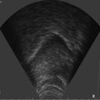

# DeepEdeg-PyTorch
A implementation of DeepEdge in PyTorch.

See my other repositories github.com/WeirongChen/DeepEdge for details about DeepEdge.

- Pretrained model in PyTorch can be downloaded here: 
 [DeepEdge_PyTorch_model](https://yaleedu-my.sharepoint.com/:u:/r/personal/wei-rong_chen_yale_edu/Documents/PublicShare/DeepEdge/DeepEdge_PyTorch_model.pth?csf=1&web=1&e=4S9PC9)    

This program is free software under GNU General Public License, version 3.  
This program is distributed WITHOUT ANY FORM of EXPRESS or IMPLIED WARRANTY and ANY SUPPORT.    
See the GNU General Public License for more details.  
